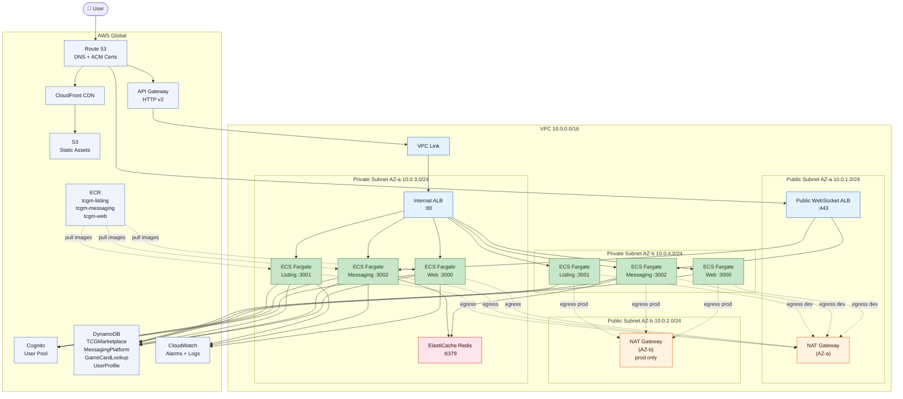

# TCG Marketplace — Infrastructure Overview

## Cloud Provider & IaC

**AWS** with raw **CloudFormation YAML** templates, organized into 5 sequential stacks under `infra/stacks/`.

---

## The 5 Stacks

### `01-foundation.yaml` — Networking & Compute

- **VPC** (10.0.0.0/16) with 2 public + 2 private subnets across 2 AZs
- **ECS Fargate** cluster
- **Two ALBs:**
  - Internal ALB (private subnets) → serves listing/messaging/web via API Gateway VPC Link
  - Public WebSocket ALB (public subnets, port 443) → for real-time Socket.io messaging
- **API Gateway** HTTP v2 bridged to internal ALB via VPC Link
- **Route 53** DNS with optional ACM certs per subdomain (`listing.*`, `messaging.*`, `ws.*`)

### `02-security.yaml` — Container Registry

- 3 **ECR repos**: `tcgm-listing`, `tcgm-messaging`, `tcgm-web`
- Lifecycle policy: keeps last 50 images

### `03-data.yaml` — Storage & Data

- **4 DynamoDB tables** (on-demand billing, PITR enabled, streams on):
  - `TCGMarketplace` — listings (4 GSIs: seller, updated time, card name, price)
  - `MessagingPlatform` — conversations (GSIs for user/message filtering)
  - `GameCardLookup` — card metadata
  - `UserProfile` — Cognito user mapping
- **ElastiCache Redis** (t3.micro) in private subnets for the messaging service
- **S3 + CloudFront** CDN for static assets (SigV4 signed)

### `04-services.yaml` — ECS Services & Scaling

- 3 Fargate services: listing (`:3001`), messaging (`:3002`), web (`:3000`)
- Each task: 256 CPU / 512 MB, no public IP, deployed in private subnets
- Deployment circuit breaker with auto-rollback enabled
- Target-tracking auto-scaling at 70% CPU utilization
- CloudWatch alarms for CPU >85%, memory >85%, and zero running tasks

### `05-auth.yaml` — Authentication

- **Cognito User Pool** — email-verified, case-insensitive usernames
- Admin + User groups; 1hr access tokens, 30-day refresh tokens
- Lambda custom resource auto-creates a super admin account on deploy

---

## Dev vs Production (`isHA` parameter)

| | `isHA=false` (Dev) | `isHA=true` (Prod) |
|---|---|---|
| **NAT Gateways** | 1 (AZ-a only) | 2 (one per AZ) |
| **AZ-b private routing** | Falls back through NAT-a | Has its own NAT-b |
| **ECS min tasks** | 1 per service | 2 per service |
| **ECS max tasks** | 2 per service | 4 per service |
| **Resilience** | Single-AZ failover risk | True multi-AZ HA |

In dev, if AZ-a goes down, private traffic in AZ-b is also disrupted since it routes through NAT-a. In prod, each AZ is fully self-sufficient.

---

## Architecture Diagram



All ECS tasks live in private subnets with no direct internet exposure. Outbound traffic flows through NAT gateways.

---

## Key Networking Layout

```
VPC 10.0.0.0/16
├── Public Subnet AZ-a  (10.0.1.0/24)  — NAT Gateway, Public ALB
├── Public Subnet AZ-b  (10.0.2.0/24)  — NAT Gateway (prod only), Public ALB
├── Private Subnet AZ-a (10.0.3.0/24)  — ECS tasks, Internal ALB, Redis
└── Private Subnet AZ-b (10.0.4.0/24)  — ECS tasks, Internal ALB
```

---

## Security Group Rules

| Security Group | Inbound |
|---|---|
| Public ALB | 443 from `0.0.0.0/0` |
| Internal ALB | 80 from within VPC |
| ECS tasks | From ALBs only |
| ElastiCache Redis | Port 6379 from ECS tasks only |
